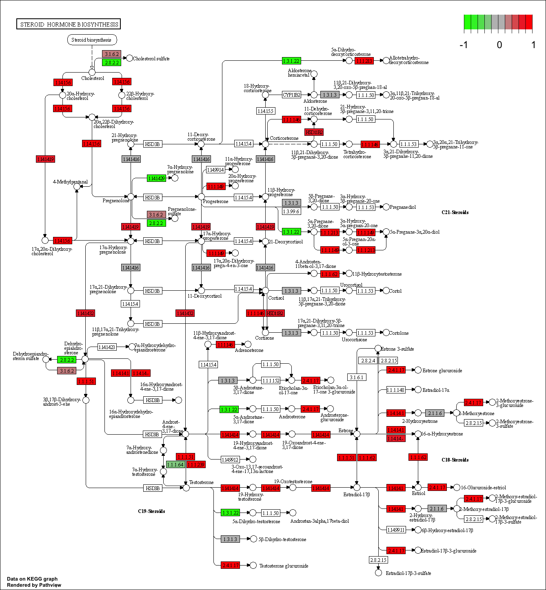
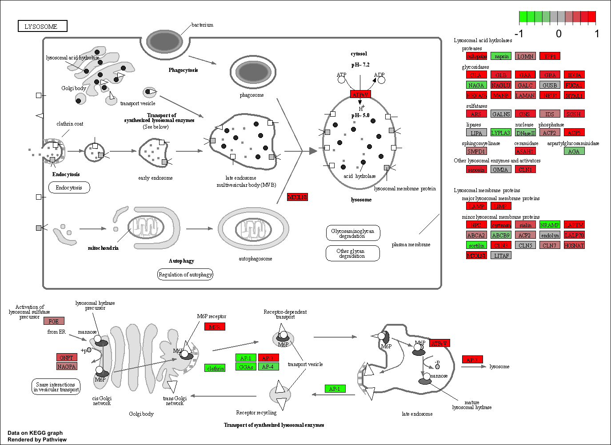
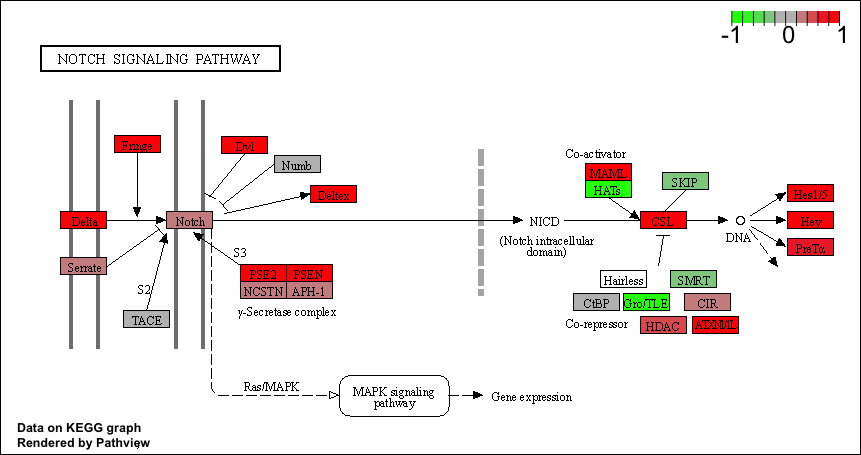

Steps to pathway analysis:

1. Data import
  - countData
  - colData (metadata)
2. PCA (QC)
3. DESeq analysis
4. Figures (e.g. Volcano plot)
5. Annotation
6. Pathway analysis

# Section 1. Differential Expression Analysis

```{r}
library(DESeq2)
```

Load our data files

```{r}
metaFile <- "GSE37704_metadata.csv"
countFile <- "GSE37704_featurecounts.csv"

# Import metadata and take a peak
colData = read.csv(metaFile, row.names=1)
head(colData)

# Import countdata
countData = read.csv(countFile, row.names=1)
head(countData)
```

The countData and colData files need to match up so we need to remove the first column in countData (contData$length). 

> Q. Complete the code below to remove the troublesome first column from countData

```{r}
# Note we need to remove the odd first $length col
countData <- as.matrix(countData[,-1])
head(countData)
```

> Q. Complete the code below to filter countData to exclude genes (i.e. rows) where we have 0 read count across all samples (i.e. columns).

```{r}
# Filter count data where you have 0 read count across all samples.
countData = countData[(rowSums(countData) != 0), ]
head(countData)
nrow(countData)
```

# PCA (Quality Control)

```{r}
pca <- prcomp(t(countData))
summary(pca)

plot(pca$x[,1], pca$x[,2], pch=16, col=as.factor(colData$condition), xlab="PC1", ylab="PC2")
text(pca$x[,1:2], labels = colData$condition)
```

# Running DESeq2

Now setup the DESeqDataSet object required for the DESeq() function and then run the DESeq pipeline.

```{r}
dds = DESeqDataSetFromMatrix(countData=countData,
                             colData=colData,
                             design=~condition)

dds = DESeq(dds)
dds
```

Let's get the results for the HoxA1 knockdown versus control siRNA
```{r}
res = results(dds)
```

> Q. Call the summary() function on your results to get a sense of how many genes are up or down-regulated at the default 0.1 p-value cutoff.

```{r}
summary(res)
```

# Volcono plot

Make a volcano plot of log2 fold change vs -log adjusted p-value.

```{r}
plot( res$log2FoldChange, -log(res$padj) )
```

> Q. Improve this plot by completing the below code, which adds color and axis labels

```{r}
# Make a color vector for all genes
mycols <- rep("gray", nrow(res) )

# Color red the genes with absolute fold change above 2
mycols[ abs(res$log2FoldChange) > 2 ] <- "red"

# Color blue those with adjusted p-value less than 0.01
#  and absolute fold change more than 2
inds <- (res$padj < 0.01) & (abs(res$log2FoldChange) > 2 )
mycols[ inds ] <- "blue"

plot( res$log2FoldChange, -log(res$padj), col=mycols, xlab="Log2(FoldChange)", ylab="-Log(P-value)" )
```

# Adding gene annotation

Since we mapped and counted against the Ensembl annotation, our results only have information about Ensembl gene IDs. However, our pathway analysis will use KEGG pathways, and genes in KEGG pathways are annotated with Entrez gene IDs. Let's add them.

> Q. Use the mapIDs() function multiple times to add SYMBOL, ENTREZID and GENENAME annotation to our results by completing the code below.

```{r}
library("AnnotationDbi")
library("org.Hs.eg.db")

columns(org.Hs.eg.db)

res$symbol = mapIds(org.Hs.eg.db,
                    keys=row.names(res),  # Gene names corresponding to each row
                    keytype="ENSEMBL",    # The format of our gene IDs
                    column="SYMBOL",      # The format we want to add
                    multiVals="first")

res$entrez = mapIds(org.Hs.eg.db,
                    keys=row.names(res),
                    keytype="ENSEMBL",
                    column="ENTREZID",
                    multiVals="first")

res$name =   mapIds(org.Hs.eg.db,
                    keys=row.names(res),
                    keytype="ENSEMBL",
                    column="GENENAME",
                    multiVals="first")

head(res, 10)
```

> Q. Finally for this section let's reorder these results by adjusted p-value and save them to a CSV file in your current project directory.

```{r}
res = res[order(res$pvalue),]
write.csv(res, file="deseq_results.csv")
```

# Section 2. Pathway Analysis

Load packages

```{r}
library(pathview)
library(gage)
library(gageData)
```

Let's setup the KEGG datasets we need. The gageData package has pre-compiled databases mapping genes to KEGG pathways and GO terms for common organisms. The kegg.sets.hs is a named list of 229 elements. Each element is a character vector of member gene Entrez IDs for a single KEGG pathway. The sigmet.idx.hs is an index of numbers of signaling and metabolic pathways in kegg.set.gs. In other words, KEGG pathway include other types of pathway definitions, like "Global Map" and "Human Diseases", which may be undesirable in a particular pathway analysis. Therefore, kegg.sets.hs[sigmet.idx.hs] gives you the "cleaner" gene sets of signaling and metabolic pathways only.

```{r}
data(kegg.sets.hs)
data(sigmet.idx.hs)

# Focus on signaling and metabolic pathways only
kegg.sets.hs = kegg.sets.hs[sigmet.idx.hs]

# Examine the first 3 pathways
head(kegg.sets.hs, 3)
```

The main gage() function requires a named vector of fold changes, where the names of the values are the Entrez gene IDs.

```{r}
foldchanges = res$log2FoldChange
names(foldchanges) = res$entrez
head(foldchanges)
```

Run the gage pathway analysis.

```{r}
# Get the results
keggres = gage(foldchanges, gsets=kegg.sets.hs)
```

```{r}
attributes(keggres)
```

Lets look at the first few down (less) pathway results. We can use the dollar sign to access a named element, e.g. head(keggres$greater) and head(keggres$less).

```{r}
# Look at the first few down (less) pathways
head(keggres$less)
```

Use the pathview() function from the pathview package to make a pathway plot with our RNA-Seq expression results shown in color. To begin, with lets manually supply a pathway.id (namely the first part of the "hsa04110 Cell cycle") that we could see from the print out above.

```{r}
pathview(gene.data=foldchanges, pathway.id="hsa04110")
```


```{r}
# A different PDF based output of the same data
pathview(gene.data=foldchanges, pathway.id="hsa04110", kegg.native=FALSE)
```

Let's our results to pull out the top 5 upregulated pathways, then further process that to get the pathway IDs needed by the pathview() function. We'll use these KEGG pathway IDs for pathview plotting below.

```{r}
## Focus on top 5 upregulated pathways here for demo purposes only
keggrespathways <- rownames(keggres$greater)[1:5]

# Extract the 8 character long IDs part of each string
keggresids = substr(keggrespathways, start=1, stop=8)
keggresids
```

Pass these IDs in keggresids to the pathview() function to draw plots for all the top 5 pathways.

```{r}
pathview(gene.data=foldchanges, pathway.id=keggresids, species="hsa")
```








> Q. Can you do the same procedure as above to plot the pathview figures for the top 5 down-reguled pathways? (See code below)

```{r}
## Focus on top 5 downregulated pathways here for demo purposes only
keggrespathways <- rownames(keggres$less)[1:5]

# Extract the 8 character long IDs part of each string
keggresids_down = substr(keggrespathways, start=1, stop=8)
keggresids_down

pathview(gene.data=foldchanges, pathway.id=keggresids_down, species="hsa")
```

# Section 3. Gene Ontology (GO)

We can also do a similar procedure with gene ontolog. Let's focus on biological processes. 

```{r}
data(go.sets.hs)
data(go.subs.hs)

# Focus on Biological Process subset of GO
gobpsets = go.sets.hs[go.subs.hs$BP]

gobpres = gage(foldchanges, gsets=gobpsets, same.dir=TRUE)

lapply(gobpres, head)
```

# Section 4. Reactome Analysis

Let's conduct over-representation enrichment analysis and pathway-topology analysis with Reactome using the previous list of significant genes generated from our differential expression results above.

First, output the list of significant genes at the 0.05 level as a plain text file:

```{r}
sig_genes <- res[res$padj <= 0.05 & !is.na(res$padj), "symbol"]
print(paste("Total number of significant genes:", length(sig_genes)))

write.table(sig_genes, file="significant_genes.txt", row.names=FALSE, col.names=FALSE, quote=FALSE)
```

To perform pathway analysis online go to the Reactome website and upload the significant gene list. Set the paramters to “Project to Humans" and click “Analyze”.

> Q: What pathway has the most significant “Entities p-value”? Do the most significant pathways listed match your previous KEGG results? What factors could cause differences between the two methods?

> The pathway with the most significant entities p-value is Endosomal/Vacuolar pathway. No, they are not the same. There are some similarities between the pathways and their functions, but the differences are likely due to the use of different biological information for mapping genes to pathways. 
