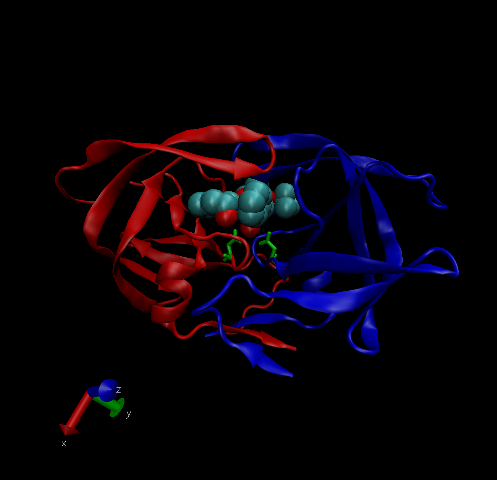

Read in csv file from the PDB site

```{r}
db <- read.csv("Data Export Summary.csv", row.names=1)
head(db)
```

> Q1: What percentage of structures in the PDB are solved by X-Ray and Electron Microscopy.

```{r}
sum(db$X.ray)/sum(db$Total) # 0.8752836 = 87.53% of structures are solved by X-Ray
sum(db$EM)/sum(db$Total) # 0.0494687 = 4.95% of structures are solved by EM
```

```{r}
round((colSums(db) / sum(db$Total)) * 100, 2) # percentage of structures in the PDB that are solved by each technique
```

> Q2: What proportion of structures in the PDB are protein?

```{r}
round((db$Total[1]/sum(db$Total)) * 100, 2) # 87.35%
```

> Q3: Type HIV in the PDB website search box on the home page and determine how many HIV-1 protease structures are in the current PDB? 23409



# Using Bio3D in R for structural bioinformatics

```{r}
library(bio3d)

pdb <- read.pdb("1hel")
pdb
```

```{r}
pdb$atom
```

```{r}
pdb <- read.pdb("1hel")

m <- nma(pdb)
plot(m)
```
Make a little movie (trajectory) for viewing in VMD. 

```{r}
mktrj(m, file="nma.pdb")
```


